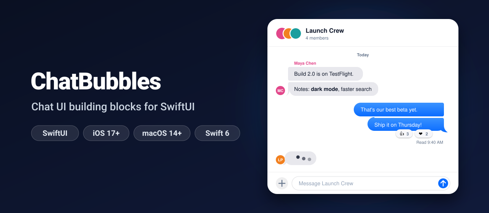
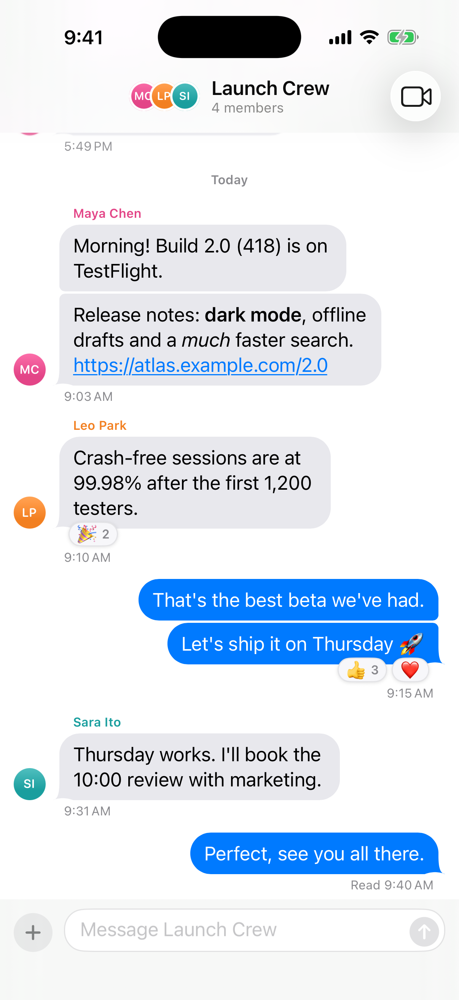
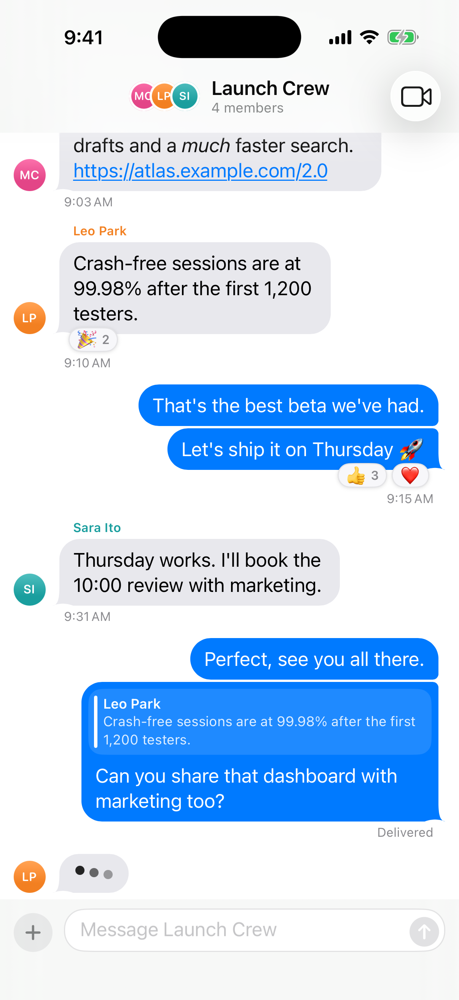
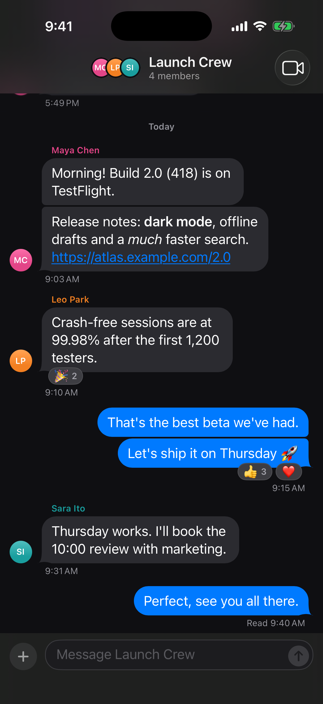
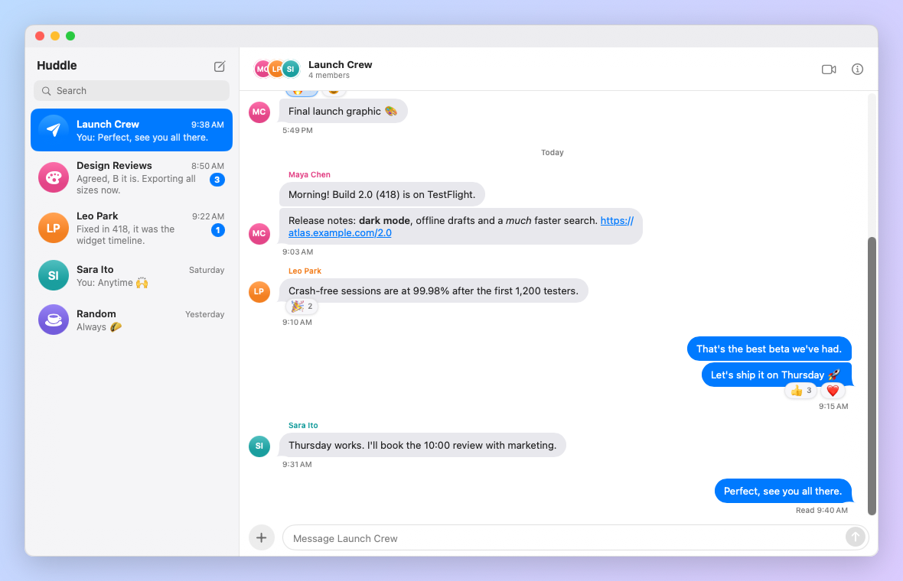

<p align="center">
  
</p>

<p align="center">
  <a href="https://github.com/halilozel1903/ChatBubbles/actions/workflows/ci.yml"></a>
  
  
  
  
  <a href="LICENSE"></a>
</p>

**ChatBubbles** gives your SwiftUI app the parts of a chat screen on iPhone and Mac: **message bubbles with tails**, **grouping** of consecutive messages, **day separators and timestamps**, **reactions**, **read receipts**, a **typing indicator** and an **input bar**, put together in a `ChatView` that scrolls the way chats should. The grouping, date and scrolling rules are plain Swift with an injected clock, calendar and locale, and tested with Swift Testing.

```swift
ChatView(messages: messages, currentUserID: "me", participants: team)
    .safeAreaInset(edge: .bottom, spacing: 0) {
        ChatInputBar(text: $draft) { text in send(text) }
    }
```

## Screenshots

Captured from the example app, *Huddle*, on an iOS 26 simulator and macOS 26 by CI.

| Conversation | Typing and a reply | Dark mode |
| :---: | :---: | :---: |
|  |  |  |

On the Mac, next to a sidebar of chats:

<p align="center">
  
</p>

## Features

- **Grouping** (`MessageGrouping`): consecutive messages from the same sender within five minutes (or your gap) on the same day form a group. Each bubble gets a `BubblePosition` (`single`, `first`, `middle`, `last`) that decides its corners, its tail, the sender's name (above the first) and the avatar (next to the last).
- **Bubbles with tails** (`BubbleShape`, `MessageBubble`): a custom `Shape` with a radius per corner and a tail on the sender's side; tighter corners where bubbles of a group touch. Outgoing and incoming styles.
- **Rich content**: inline Markdown (`**bold**`, `*italic*`, `` `code` ``, `[links](…)`), bare URLs turned into underlined links, an image attachment (asset or URL) and a reply quote at the top of the bubble.
- **Day separators** (`ChatDateFormatter`): "Today", "Yesterday", the weekday within the last week, then "Mon, Sep 28" and "Sep 14, 2025", from an injected `now`, calendar and locale.
- **Timestamps and read receipts**: the time under the last bubble of every group; "Sending…", "Sent", "Delivered", "Read 9:40 AM" or "Not delivered" under your latest message.
- **Reactions** (`ReactionsBar`): emoji chips with counts tucked under the bubble, yours highlighted; tap a chip or pick one from the bubble's context menu, and `ChatReaction.toggling` updates the counts.
- **Typing indicator** (`TypingIndicator`): three dots in a wave, still dots in three shades with Reduce Motion, and frozen at a fixed frame for screenshots.
- **Input bar** (`ChatInputBar`): a text field that grows to six lines, an attachment button and a send button that only lights up when there is something to send. Return sends on the Mac.
- **`ChatView`**: opens at the newest message, follows new messages while you are at the bottom (always for your own), keeps your place when older messages load at the top, and shows a jump-to-bottom button when you scroll away.
- **Theming** (`ChatTheme`): colors, fonts, radii, tail size, spacing and the widest bubble, with `.default`, `.graphite` and `.meadow` presets. Light and dark mode.
- **Swift 6 strict concurrency**, zero dependencies, the grouping, dates, text, reactions and scrolling rules tested with Swift Testing.

## Installation

In Xcode choose **File › Add Package Dependencies…** and enter:

```
https://github.com/halilozel1903/ChatBubbles
```

Or add it to `Package.swift`:

```swift
dependencies: [
    .package(url: "https://github.com/halilozel1903/ChatBubbles", from: "1.0.0")
]
```

## Usage

### A chat screen

```swift
import ChatBubbles
import SwiftUI

struct TeamChatView: View {
    @State private var model = TeamChatModel()
    @State private var draft = ""

    var body: some View {
        ChatView(
            messages: model.messages,                    // oldest first
            currentUserID: model.me,
            participants: model.members,                 // names, colors and initials
            typingSenderIDs: model.typing,               // the indicator shows while not empty
            hasOlderMessages: model.hasMore,
            loadOlder: { [model] in await model.loadOlder() },
            onToggleReaction: { message, emoji in model.toggle(emoji, on: message.id) }
        )
        .safeAreaInset(edge: .bottom, spacing: 0) {
            ChatInputBar(text: $draft, onAttach: { model.pickPhoto() }) { text in
                model.send(text)
            }
        }
        .navigationTitle("Launch Crew")
    }
}
```

`ChatView` also takes `dateFormatter`, `maximumGroupGap` (seconds), `showsSenderNames` and `showsAvatars` (turn both off for one-to-one chats) and `quickReactions` (the emoji of the context menu).

### Messages

Use `SimpleMessage`, or conform your own type to `ChatMessage`. Only four properties are required; attachments, replies, reactions and the status have defaults.

```swift
let message = SimpleMessage(
    senderID: "maya",
    sentAt: .now,
    text: "Release notes: **dark mode** and offline drafts. https://example.com/2.0",
    attachment: .image(name: "LaunchBoard", aspectRatio: 4 / 3, description: "The launch graphic"),
    reply: ChatReply(messageID: "m-8", senderName: "Leo Park", text: "Crash-free sessions are at 99.98%"),
    reactions: [ChatReaction(emoji: "🎉", count: 2), ChatReaction(emoji: "👍", count: 1, includesMe: true)],
    status: .read(at: .now)
)

struct Note: ChatMessage {
    let id: UUID
    let senderID: String
    let sentAt: Date
    let text: String
}
```

| `DeliveryStatus` | Shown under your latest message |
| --- | --- |
| `.sending` | Sending… |
| `.sent` | Sent |
| `.delivered` | Delivered |
| `.read(at: date)` | Read 9:40 AM (today), Read Yesterday (earlier), or Read |
| `.failed` | Not delivered, in red, under every failed message |

Reactions are counted per emoji. Toggle the current user's reaction like this:

```swift
message.reactions = ChatReaction.toggling("👍", in: message.reactions)   // adds yours, or takes it back
```

### Building blocks

Every piece works on its own for custom layouts:

```swift
MessageBubble(message: message, isOutgoing: true, position: .last)
ReactionsBar(reactions: message.reactions) { reaction in toggle(reaction.emoji) }
TypingIndicator()
ChatAvatar(participant: ChatParticipant(id: "maya", name: "Maya Chen", color: .pink))
ReplyQuote(reply: reply, isOutgoing: false)

Text("Hi!")
    .padding(12)
    .padding(.trailing, 6)                                                 // room for the tail
    .background(BubbleShape(position: .single, isOutgoing: true).fill(.blue))
```

### Grouping and dates without the views

```swift
let grouping = MessageGrouping(currentUserID: "me", maximumGap: 5 * 60, calendar: calendar)
let formatter = ChatDateFormatter(calendar: calendar, locale: Locale(identifier: "en_US"), now: now)

for item in grouping.items(for: messages) {
    switch item {
    case .daySeparator(let day):
        print("—", formatter.dayTitle(for: day), "—")                       // "Today", "Saturday", "Mon, Sep 28"
    case .message(let entry):
        print(entry.position, entry.isOutgoing, entry.message.text)
        if entry.showsTimestamp { print(formatter.time(for: entry.message.sentAt)) }       // "9:41 AM"
        if entry.showsStatus { print(formatter.receipt(for: entry.message.status)) }        // "Read 9:40 AM"
    }
}

grouping.positions(for: messages)          // [.first, .middle, .last, .single, …]
```

| Position | Corners on the sender's side | Tail | Name | Avatar | Time |
| --- | --- | --- | --- | --- | --- |
| `single` | round, round | yes | yes | yes | yes |
| `first` | round, tight | no | yes | no | no |
| `middle` | tight, tight | no | no | no | no |
| `last` | tight, round | yes | no | yes | yes |

A new group starts when the sender changes, when more than `maximumGap` passes, or at midnight in the calendar's time zone. Localize the separators with `ChatDateFormatter(todayTitle: "Bugün", yesterdayTitle: "Dün")`; weekdays and dates follow the locale.

### Theming

```swift
ChatView(messages: messages, currentUserID: "me")
    .chatTheme(.graphite)

var theme = ChatTheme.default
theme.outgoingBackground = .indigo
theme.incomingBackground = .adaptive(light: .init(white: 0.93), dark: .init(white: 0.18))
theme.cornerRadius = 20
theme.groupedCornerRadius = 6
theme.showsTails = false
theme.maximumBubbleWidth = 480
ChatView(messages: messages, currentUserID: "me").chatTheme(theme)
```

| Preset | Look |
| --- | --- |
| `.default` | Blue outgoing bubbles with tails, light gray incoming bubbles |
| `.graphite` | Dark gray outgoing bubbles, orange accent, 14 pt corners |
| `.meadow` | Green bubbles without tails, round corners everywhere |

### Input bar

```swift
ChatInputBar(
    text: $draft,
    placeholder: "Message Launch Crew",
    sendsOnReturn: nil,                 // the platform default: Return sends on the Mac only
    onAttach: { showsPhotoPicker = true },
    onSend: { text in model.send(text) }  // trimmed; the draft is cleared
)
```

On the Mac, Option-Return starts a new line.

### Previews and screenshots

Inject the clock so day titles never change, and freeze the typing indicator:

```swift
#Preview {
    ChatView(
        messages: SampleData.messages,
        currentUserID: "me",
        typingSenderIDs: ["leo"],
        dateFormatter: ChatDateFormatter(calendar: utc, locale: Locale(identifier: "en_US"), now: fixedNow)
    )
    .typingIndicatorFrozen(at: 0.3)
}
```

## How it works

- **Scrolling**: `ChatView` is a `LazyVStack` in a `ScrollView` with `defaultScrollAnchor(.bottom)`. `TranscriptChange.between(old, new)` compares the message ids of two updates: appended messages scroll to the bottom when they are yours or you were already there, prepended (older) messages scroll back to the message that was first, so the content does not jump. An invisible row at the end tells whether you are at the bottom.
- **The tail** is drawn in a strip `tailWidth` points wide on the sender's side, so bubbles with and without a tail line up. Incoming bubbles are the outgoing path mirrored.
- **Links**: Markdown is parsed with `AttributedString(markdown:)` (inline only, line breaks kept), then `NSDataDetector` finds the remaining web addresses.
- **Reduce Motion** stops the typing animation; the dots show three shades instead.

## Example app

The `Example` folder contains *Huddle*, a made-up team chat for iPhone and Mac: five chats, the Launch Crew getting version 2.0 of their app out. Send a message and watch it go from Sending to Delivered to Read, then someone types and answers; tap a reaction or long-press (right-click on the Mac) a bubble to react; scroll to the top to load older messages; the plus button sends a photo. It uses [XcodeGen](https://github.com/yonaskolb/XcodeGen) so no project file has to live in the repo:

```bash
brew install xcodegen
cd Example && xcodegen generate
open ChatBubblesDemo.xcodeproj    # schemes ChatBubblesDemo (iPhone) and ChatBubblesDemoMac
```

The screenshots come from `scripts/screenshots.sh` and `scripts/screenshots-mac.sh`. Launched with `-screenshot <scene>` (`conversation`, `typing` or `dark`), the app shows fixed messages with a fixed clock (Monday, October 5, 2026, 9:41 AM UTC, US English) and a frozen typing indicator. On iPhone the app writes a marker file once the scene is on screen and the script captures the simulator with `simctl io screenshot`; on the Mac the scene is shown in a borderless window and captured with `screencapture -l`, with the app's own renderer (`-render-screenshot <file>`) as the fallback. Both scripts fail instead of saving a blank or stale capture.

## Requirements

- Xcode 26 or later (Swift 6.2 toolchain)
- iOS 17+ or macOS 14+

## Contributing

Issues and pull requests are welcome. Please run `swift test` before opening a PR.

## License

ChatBubbles is available under the MIT license. See [LICENSE](LICENSE).
